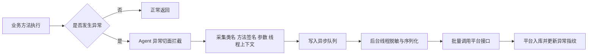
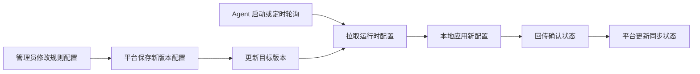
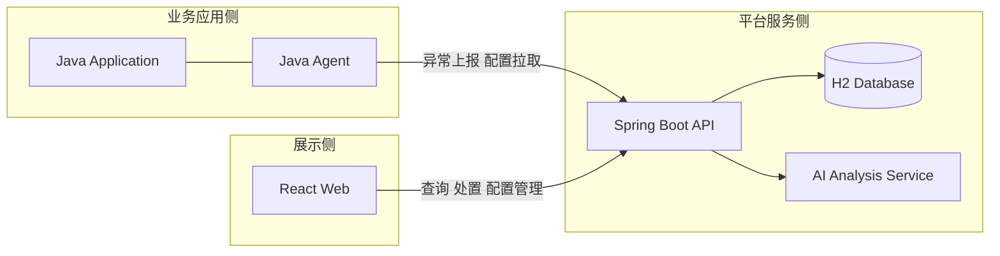
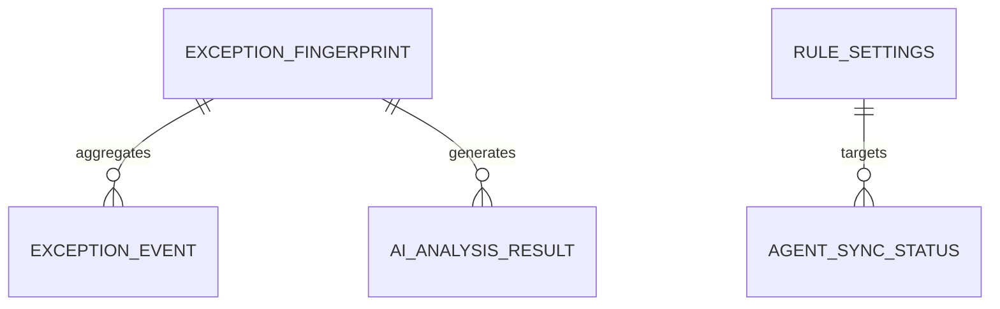

# 本科毕业设计（论文）

## 题目：零侵入异常监控平台设计与实现

### Design and Implementation of a Zero-Intrusion Exception Monitoring Platform

## 摘要

在 Java 应用的日常运维过程中，异常定位通常依赖日志检索、人工复现和临时加日志等方式完成。这种处理模式存在接入成本高、现场信息不完整、问题链路不清晰以及排查效率低等问题，尤其在多模块服务和频繁迭代的开发场景下，传统方式难以及时提供可用于定位问题的上下文数据。针对上述问题，本文设计并实现了一套零侵入异常监控平台，通过 Java Agent 技术在不修改业务代码的前提下实现异常自动采集，并结合后端分析平台与前端可视化界面形成异常发现、聚合、分析与处置的闭环。

本文平台整体采用“采集端 + 分析端 + 展示端”的分层架构。采集端基于 Java Agent 与 Byte Buddy 实现运行时字节码增强，在目标方法抛出异常时自动收集类名、方法签名、异常消息、堆栈信息、参数快照、线程信息以及链路上下文等数据，并通过异步队列与批量上报机制降低对业务线程的干扰。为保证采集过程的安全性与稳定性，系统设计了序列化深度限制、长度限制、集合截断、循环引用保护和敏感字段脱敏等机制。分析端采用 Spring Boot、Spring Data JPA 和 H2 数据库构建异常接收、异常指纹聚合、趋势统计、状态流转、运行时配置下发和 Agent 同步状态管理等能力，同时接入 AI 分析服务生成根因分析与处理建议。展示端基于 React 18 与 Vite 实现登录鉴权、异常概览、异常列表、异常详情和系统配置等页面，提升异常信息的可读性和处理效率。

在验证方面，本文结合现有自动化测试与前端构建验证系统的核心能力，包括敏感信息脱敏、异常指纹聚合、权限控制、配置同步和 AI 建议生成等功能。后端模块共执行 20 项自动化测试且全部通过，Agent 模块执行 1 项核心测试并通过，前端系统完成生产构建验证。结果表明，该平台能够在保持业务代码零侵入的前提下有效捕获异常上下文，并通过统一平台完成异常事件的存储、检索、分析与处置，具有较好的工程实用价值。

关键词：Java Agent；异常监控；Byte Buddy；Spring Boot；React；零侵入

## Abstract

In daily Java application operations, exception diagnosis often relies on log retrieval, manual reproduction, and temporary code modifications. This approach suffers from high integration cost, incomplete runtime context, weak traceability, and low troubleshooting efficiency. To address these problems, this thesis designs and implements a zero-intrusion exception monitoring platform. The platform uses Java Agent technology to capture exception context without modifying business code, and combines a backend analysis service with a frontend visualization system to form a closed loop of exception collection, aggregation, analysis, and handling.

The platform follows a layered architecture composed of a collection side, an analysis side, and a presentation side. The collection side is built on Java Agent and Byte Buddy for runtime bytecode enhancement. When a monitored method throws an exception, the agent captures class information, method signature, exception message, stack trace, argument snapshot, thread metadata, and tracing context. An asynchronous queue and batch reporting mechanism are introduced to reduce interference with business threads. To ensure safety and robustness, the system also implements depth limits, string length limits, collection truncation, circular reference protection, and sensitive data masking. The analysis side is implemented with Spring Boot, Spring Data JPA, and an H2 database, providing exception ingestion, fingerprint aggregation, trend statistics, status management, runtime configuration distribution, and Agent synchronization tracking. In addition, an AI-assisted analysis module is integrated to generate root-cause analysis and repair suggestions. The presentation side is implemented with React 18 and Vite, covering authentication, dashboard overview, exception list, exception detail, and configuration management.

The platform is validated through automated backend tests, Agent-side unit tests, and frontend build verification. All 20 backend tests passed, the Agent module passed its core masking test, and the frontend completed a successful production build. The results show that the system can effectively capture runtime exception context in a zero-intrusion manner and provide unified storage, retrieval, analysis, and handling capabilities, which demonstrates practical value for Java application exception monitoring and troubleshooting.

Keywords: Java Agent; Exception Monitoring; Byte Buddy; Spring Boot; React; Zero Intrusion

## 目录

1. 绪论
2. 相关技术与关键机制
3. 系统需求分析
4. 系统设计
5. 系统实现
6. 系统测试
7. 结论与展望
8. 致谢
9. 参考文献

## 第1章 绪论

### 1.1 研究背景

随着企业级软件系统逐渐向服务化、组件化和快速迭代方向发展，Java 应用在生产环境中面临的异常场景日趋复杂。传统异常排查主要依赖日志输出、监控告警和人工复现等方式，但在实际运维中往往存在以下问题：其一，日志内容通常只包含异常消息与部分堆栈，缺少触发异常的参数、对象状态和链路上下文；其二，为了获取更详细现场信息，开发人员需要临时修改业务代码、增加埋点或补充日志，这会带来接入成本和发布风险；其三，当异常发生在调用链中间环节时，仅凭静态日志很难快速界定问题边界和影响范围。

在这一背景下，零侵入异常采集成为一个具有现实意义的工程方向。所谓零侵入，是指在不修改业务系统源代码的前提下，通过运行时技术手段自动采集异常现场信息，并将其统一汇聚到分析平台。Java 生态天然支持 `-javaagent` 启动参数和字节码增强机制，为此类系统提供了良好的技术基础[1]。通过 Java Agent 对目标包下的方法进行运行时增强，可以在异常抛出瞬间捕获上下文信息，而不需要业务开发人员显式接入 SDK 或修改代码。

另一方面，仅有采集能力还不足以形成有效的异常治理闭环。工程实践中更需要一个统一平台来完成异常事件入库、异常指纹聚合、趋势统计、状态流转、权限控制、配置下发和处置建议生成等工作。特别是在面向运维、测试和开发协同的场景下，异常监控系统应当兼顾采集端的低侵入、平台端的可扩展和前端界面的可用性。因此，围绕“采集-分析-展示-处置”全链路构建一个可运行的异常监控平台，具有较高的工程实践价值和毕业设计价值。

### 1.2 研究目的与意义

本文的研究目标是设计并实现一套面向 Java 应用的零侵入异常监控平台，使系统能够在不修改业务代码的前提下自动捕获异常现场，并为异常查询、聚合分析、处理建议和配置管理提供统一支撑。围绕这一目标，本文希望解决以下几个关键问题：

1. 如何以零侵入方式完成异常采集，并尽可能保留异常发生时的上下文信息。
2. 如何在采集详细信息的同时控制对业务主线程的性能影响和稳定性风险。
3. 如何对大量异常事件进行聚合、归类和状态管理，提升问题定位效率。
4. 如何为平台用户提供直观的异常概览、详情查看和配置管理界面。

本课题的意义主要体现在以下几个方面。首先，在工程意义上，本文通过 Java Agent 与字节码增强技术降低了异常监控系统的接入门槛，使采集能力从“改代码接入”转变为“启动参数挂载”，提升了系统推广性。其次，在运维价值上，平台通过异常指纹聚合、趋势分析和详情展示提升了定位效率，减少了仅凭日志排障带来的信息缺失。再次，在安全与可靠性方面，系统引入脱敏、深度限制、循环引用保护和异步批量上报机制，有助于控制异常采集本身带来的风险。最后，在毕业设计层面，本文覆盖需求分析、架构设计、关键技术实现、系统测试等完整工程流程，具备较为完整的设计与实现闭环。

### 1.3 国内外研究现状

从异常监控与应用可观测性的研究与产品实践来看，国内外已经形成了以日志平台、APM 平台和异常追踪平台为核心的多类解决方案。日志平台更侧重日志采集、检索和全文检索能力，适合做事后分析，但在异常现场数据结构化采集方面通常依赖业务埋点。APM 平台强调指标、链路与性能分析，能够提供服务调用关系和性能热点，但其异常现场信息往往集中在堆栈和链路层面，对具体方法参数和对象状态的保留程度有限。异常追踪类方案则关注错误聚合和告警，但在 Java 业务系统中多数仍需要 SDK 接入或框架层适配。

在 Java 技术体系中，Java Agent 和字节码增强技术为零侵入监控提供了重要支撑。通过 `Instrumentation` 接口配合字节码增强工具，可以在类加载时对目标方法插入额外逻辑，从而完成调用拦截、异常捕获和上下文采集。Byte Buddy 等工具在表达能力、兼容性和工程可维护性方面较为成熟，已广泛用于监控、性能分析和测试场景[2]。相比手工 ASM 操作，这类工具显著降低了增强逻辑的复杂度。

在异常分析方面，近年来系统不再满足于“记录异常”，而是开始强调聚合、归因和辅助处置。异常指纹技术通过对异常类型、关键堆栈和调用位置进行归一化处理，将大量重复异常聚合为更稳定的事件类别，有利于统计趋势和减少重复处理。与此同时，大语言模型的发展也使“异常描述转处理建议”成为可行方向，但在工程系统中，AI 分析通常更适合作为辅助能力，而非替代基础的结构化异常治理流程。

综合来看，现有研究和产品为异常监控系统建设提供了较多思路，但在“面向毕业设计的可落地闭环实现”这一层面，仍需将零侵入采集、平台聚合分析、权限控制、配置同步和前端展示等能力整合为一个统一系统。本文的工作正是围绕这一工程落地目标展开。

### 1.4 本文主要工作与章节安排

本文围绕零侵入异常监控平台的设计与实现开展工作，主要完成了以下内容：

1. 设计并实现了基于 Java Agent 与 Byte Buddy 的异常采集机制，可在方法抛出异常时自动捕获上下文信息。
2. 设计了安全序列化与脱敏方案，实现深度限制、长度限制、集合截断、循环引用保护和敏感字段掩码处理。
3. 实现了基于 Spring Boot 的异常分析平台，支持异常事件接收、指纹聚合、趋势统计、状态管理、配置下发和 Agent 同步状态跟踪。
4. 实现了基于 React 的前端系统，支持异常概览、异常列表、异常详情、配置管理和角色鉴权。
5. 结合自动化测试与构建验证，对系统关键功能进行了验证。

全文共分为七章，各章节安排如下：

第 1 章为绪论，介绍研究背景、研究意义、研究现状以及本文工作内容。  
第 2 章介绍系统实现所依赖的关键技术与机制，包括 Java Agent、Byte Buddy、Spring Boot、React 以及异常指纹和配置同步机制。  
第 3 章对系统进行需求分析，从可行性、功能需求、非功能需求和业务流程等方面展开。  
第 4 章介绍系统总体设计，包括总体架构、模块划分、数据库设计、接口设计和安全设计。  
第 5 章介绍系统的具体实现，分别从 Agent、后端平台和前端界面三个层面说明。  
第 6 章对系统进行测试与验证，分析系统在异常采集、脱敏、安全控制和前端构建等方面的表现。  
第 7 章总结全文工作，并对后续改进方向进行展望。

### 1.5 本章小结

本章从实际工程问题出发，分析了传统异常排查方式在现场缺失和接入成本方面的不足，说明了构建零侵入异常监控平台的必要性，并给出了本文的研究目标、研究意义和全文结构安排。后续章节将围绕系统关键技术、需求分析、架构设计、具体实现和系统测试展开。

## 第2章 相关技术与关键机制

### 2.1 Java Agent 技术

Java Agent 是 Java 平台提供的运行时增强机制，允许开发者通过 `-javaagent` 参数在应用启动阶段加载自定义代理逻辑，并通过 `Instrumentation` 接口参与类加载与字节码转换[1]。相较于在业务代码中显式集成监控 SDK，Java Agent 的最大优势在于无需修改业务源代码，能够从运行时层面对目标类进行统一处理。

本文在 Agent 模块中使用 `premain` 作为入口函数，启动时读取本地参数配置，并提前初始化异步上报线程，再根据配置中指定的包名前缀构造类匹配规则，只对目标业务包进行增强。这种做法兼顾了零侵入性和控制范围，避免了对 JDK、第三方框架以及 Agent 自身类的无效增强。

### 2.2 Byte Buddy 字节码增强技术

Byte Buddy 是 Java 生态中常用的字节码增强库，提供了较高层级的 API 来定义类匹配规则、方法切面和增强行为[2]。与直接操作 ASM 相比，Byte Buddy 对目标方法、类名、构造器、修饰符等具备更强的表达能力，适合在工程项目中快速实现稳定的增强逻辑。

本文在 Agent 中使用 Byte Buddy 对目标类的方法进行拦截，并通过 `Advice` 机制在方法进入和退出时注入采集逻辑。在实现上，系统仅在方法抛出异常时触发事件收集，正常返回路径不会执行异常上报逻辑，这样既符合异常监控场景的目标，也减少了正常请求上的额外开销。

### 2.3 Spring Boot 与数据持久化技术

后端平台采用 Spring Boot 3 构建 REST 服务，利用其在自动配置、依赖管理和接口开发方面的优势实现异常接收、查询和配置管理等能力[3]。数据访问层采用 Spring Data JPA，通过实体类与仓储接口快速构建面向异常事件和异常指纹的存储模型[4]。原型系统当前使用 H2 内存数据库，具有部署简单、便于验证和适合毕业设计演示的优点[5]。

在后端层，系统按照 Controller、Service、Repository 的职责分层组织代码，异常事件接收、异常聚合、规则配置、AI 分析、鉴权拦截等能力各自独立，实现上遵循了较为清晰的单一职责划分。

### 2.4 React 与前端可视化技术

前端系统基于 React 18、React Router 6 和 Vite 构建。React 负责页面组件化开发，React Router 实现登录页、概览页、异常列表页、异常详情页和配置页的路由管理，Vite 提供快速的本地开发和前端构建能力[7][8][9]。前端通过统一的 `api.js` 封装后端接口，并在请求层处理 `Bearer Token` 注入和 `401` 状态的登录失效跳转。

通过组件化设计，系统将指标卡片、状态标签、趋势面板、外壳布局等视图抽象为可复用组件，提高了页面层次和展示一致性。

### 2.5 异常指纹聚合机制

若仅按异常事件逐条展示，平台很容易因为重复异常过多而失去可读性。因此，本文引入异常指纹机制，将异常类型、关键堆栈帧和方法签名等信息组合生成相对稳定的指纹标识。对重复异常进行聚合后，平台不仅能够统计每类异常的发生次数、首次出现时间和最近出现时间，还可以在概览页展示高频异常和趋势变化，帮助用户优先处理影响面更大的问题。

指纹聚合机制的价值不在于替代原始异常事件，而在于为原始事件提供更高一级的统计与治理视角。原始事件用于保留现场，指纹聚合用于支撑分析与处置优先级判断。

### 2.6 安全序列化与脱敏机制

异常现场采集最大的风险在于上下文对象可能非常复杂，甚至包含深层嵌套对象、循环引用、大型集合和敏感字段。如果简单地对参数对象执行递归序列化，容易带来性能问题、内存问题甚至再次触发异常。针对这一问题，本文设计了多重保护机制：

1. 使用最大递归深度限制避免深层对象图无限展开。
2. 对字符串长度设定上限，超出部分进行截断。
3. 对集合、数组和 Map 设定元素数量上限，避免一次性采集过多数据。
4. 通过身份映射检测循环引用，遇到重复对象时直接标记为循环引用。
5. 对包含 `password`、`token`、`secret`、`sensitive` 等关键字的字段和值进行掩码处理。

这些设计使采集端在尽可能保留上下文信息的同时，将风险控制在可接受范围内。

### 2.7 异步批量上报与配置同步机制

为了避免异常采集逻辑阻塞业务线程，本文在 Agent 端引入异步队列与批量上报机制。方法异常发生后，采集逻辑仅负责构建原始事件并放入内存队列，序列化、脱敏和 HTTP 上报操作由独立守护线程异步完成。这种方式显著降低了主调用线程上的额外负担。当队列满载时，系统采用丢弃计数而非阻塞业务线程的策略，从工程角度保证了业务系统优先级。

此外，平台还设计了运行时配置同步机制。后端维护统一的 Agent 运行参数，Agent 在启动后和运行期间按固定时间间隔拉取配置并回传同步状态，实现监控参数的集中管理。这一机制提升了平台在多服务场景中的可运维性。

### 2.8 本章小结

本章介绍了本文实现过程中涉及的关键技术和核心机制，包括 Java Agent、Byte Buddy、Spring Boot、React、异常指纹、安全序列化、异步上报和配置同步等内容。这些技术共同构成了零侵入异常监控平台的实现基础。

## 第3章 系统需求分析

### 3.1 可行性分析

#### 3.1.1 技术可行性

从技术角度看，Java 平台已提供成熟的 Agent 机制与 `Instrumentation` 接口，Byte Buddy 能够满足按包名前缀选择性增强和异常切面注入需求。后端方面，Spring Boot 与 Spring Data JPA 能够快速搭建 REST 服务与数据访问层，H2 适合用于原型验证和毕业设计演示。前端方面，React + Vite 的技术栈轻量且开发效率高，能够满足异常概览、详情展示和配置管理等页面需求。因此，系统整体技术路径可行。

#### 3.1.2 经济可行性

本系统以开源技术栈为主，不依赖商业授权中间件。Agent 端、后端平台与前端系统均可在普通开发机器上完成开发与验证，数据库也使用内存型 H2 作为原型支撑，因此总体实施成本较低，符合毕业设计项目的资源条件。

#### 3.1.3 操作可行性

系统面向的主要用户包括开发人员、测试人员和运维人员。平台只保留登录、异常总览、异常列表、异常详情和配置页等核心操作面，避免界面过于复杂。采集端仅需在 Java 应用启动命令中增加 `-javaagent` 参数即可接入，操作门槛较低，因此具备良好的操作可行性。

### 3.2 功能需求分析

根据系统目标，本文将功能需求划分为采集端需求、平台后端需求和前端展示需求三类。

#### 3.2.1 采集端功能需求

采集端需要满足以下功能：

| 编号 | 功能名称 | 功能说明 |
| --- | --- | --- |
| F1 | 包名前缀过滤 | 仅增强配置包下的业务类，避免无效插桩 |
| F2 | 异常现场采集 | 在方法抛出异常时自动采集类名、方法、消息、堆栈、参数和线程信息 |
| F3 | 安全序列化 | 对复杂对象进行受控序列化，支持深度限制、截断与循环引用保护 |
| F4 | 敏感信息脱敏 | 对敏感字段和值进行掩码处理 |
| F5 | 异步批量上报 | 使用内存队列和后台线程异步上报事件 |
| F6 | 运行时配置同步 | 定期从平台拉取规则配置并回传同步状态 |

#### 3.2.2 平台后端功能需求

平台后端需要提供以下能力：

| 编号 | 功能名称 | 功能说明 |
| --- | --- | --- |
| B1 | 异常接收存储 | 接收单条与批量异常事件并入库 |
| B2 | 指纹聚合 | 对重复异常进行聚合，统计次数与出现时间 |
| B3 | 趋势统计 | 统计最近若干天异常趋势 |
| B4 | 详情查询 | 支持按条件分页查询异常事件和查看详情 |
| B5 | 状态流转 | 支持异常状态从 OPEN 到 INVESTIGATING、RESOLVED 变更 |
| B6 | 配置管理 | 维护 Agent 运行参数与 AI 配置 |
| B7 | Agent 同步状态管理 | 跟踪各服务 Agent 的配置拉取与生效情况 |
| B8 | AI 建议生成 | 基于异常指纹生成根因分析与处理建议 |

#### 3.2.3 前端功能需求

前端系统需要提供统一的监控操作入口，具体包括：

| 编号 | 功能名称 | 功能说明 |
| --- | --- | --- |
| P1 | 登录鉴权 | 支持账号密码登录并保存登录态 |
| P2 | 异常概览 | 展示总异常量、待处理异常、严重异常、生效 Agent 数等指标 |
| P3 | 异常列表 | 支持按严重级别、状态、服务名、时间范围和关键词筛选 |
| P4 | 异常详情 | 查看堆栈、消息、参数快照、Trace 上下文和同步状态 |
| P5 | 建议生成与状态变更 | 在详情页生成处理建议并执行状态流转 |
| P6 | 配置管理 | 配置采样、深度限制、AI 参数和查看 Agent 同步状态 |

### 3.3 非功能需求分析

#### 3.3.1 零侵入性需求

系统应尽量避免修改业务代码，接入方式应以挂载 Agent 为主，从而降低不同业务系统的接入成本。这是本系统最核心的非功能需求之一。

#### 3.3.2 性能需求

异常监控系统不能对业务主流程造成明显阻塞。系统需要通过异步上报、队列缓冲与有限序列化等方式控制运行期开销，并在极端情况下优先保证业务线程继续执行。

#### 3.3.3 安全需求

异常现场中可能包含账号、令牌和业务敏感数据，因此系统必须提供敏感信息脱敏能力。平台侧接口还应提供鉴权与授权机制，防止未授权用户访问异常数据或修改系统配置。

#### 3.3.4 可靠性需求

即使在采集过程、序列化过程或上报过程中发生异常，系统也不能反向影响原业务系统。为此，采集端需要吞掉内部异常并提供降级处理策略。

#### 3.3.5 可维护性需求

系统应采用清晰的模块划分和职责边界，便于后续扩展数据库类型、接入更多 AI 模型、增加告警能力或适配更多 Java 服务。

### 3.4 业务流程分析

#### 3.4.1 异常采集与上报流程

业务流程为：业务方法执行 -> 发生异常 -> Agent 拦截异常 -> 采集基础上下文 -> 放入异步队列 -> 后台线程完成脱敏与序列化 -> 批量调用平台接口上报 -> 平台落库并更新指纹统计。异常采集与上报流程如图 3-1 所示。

图 3-1 异常采集与上报流程图

#### 3.4.2 配置同步流程

平台管理员在前端修改规则配置后，后端保存最新版本配置；Agent 启动时或运行期间定时从平台拉取最新运行参数，应用成功后再回传同步状态；平台通过同步状态页面展示各服务当前目标版本与已生效版本。配置同步流程如图 3-2 所示。

图 3-2 Agent 配置拉取与确认流程图

#### 3.4.3 异常处置流程

平台用户登录后进入异常概览页，可查看指标统计与高频异常；在异常列表页根据条件定位目标异常；进入详情页后查看完整现场信息、生成处理建议并更新异常状态，形成从发现到处置的闭环流程。

### 3.5 本章小结

本章从技术、经济和操作三个角度论证了系统的可行性，并结合采集端、平台端和前端三个视角梳理了系统功能需求与非功能需求。同时，本文对异常采集、配置同步和异常处置三条关键业务流程进行了分析，为后续系统设计提供了依据。

## 第4章 系统设计

### 4.1 总体架构设计

系统总体采用三层协同架构：第一层为部署在业务应用侧的 Java Agent 采集层，负责异常采集、脱敏、批量上报和配置拉取；第二层为基于 Spring Boot 的平台服务层，负责异常接收、存储、聚合、查询、配置管理和 AI 分析；第三层为基于 React 的可视化展示层，负责登录鉴权、指标展示、异常列表、详情查看和配置管理。

该架构的优点在于：采集层与业务系统松耦合，平台层便于统一治理和扩展，展示层能够根据用户角色提供不同操作面。系统中各层的职责边界清晰，符合单一职责和易维护的工程原则。系统总体架构如图 4-1 所示。

图 4-1 系统总体架构图

### 4.2 Agent 侧设计

#### 4.2.1 Agent 模块划分

Agent 模块主要包含以下核心组件：

| 模块 | 主要职责 |
| --- | --- |
| `ZeroMonitorAgent` | Agent 入口，解析参数并安装增强逻辑 |
| `AgentConfig` | 本地参数解析、远程配置拉取与同步确认 |
| `ExceptionAdvice` | 方法异常切面，捕获异常并触发事件收集 |
| `EventCollector` | 组装异常事件对象 |
| `SnapshotSerializer` | 复杂对象安全序列化 |
| `SensitiveDataSanitizer` | 文本与结构化数据脱敏 |
| `AsyncReporter` | 队列缓冲、批量发送与失败重试 |

#### 4.2.2 异常采集设计

Agent 启动后通过包名前缀构造类型匹配器，并忽略 `java.*`、`javax.*`、`jdk.*`、`sun.*`、Byte Buddy 自身和 Agent 自身类，避免无意义增强。对于目标类下的普通方法，`ExceptionAdvice` 在方法进入时保留参数引用，在方法退出阶段判断是否抛出异常，仅在存在 `Throwable` 时调用事件收集逻辑。

#### 4.2.3 安全采集设计

考虑到对象图复杂度和敏感信息问题，采集端设计了多重防护：

1. 参数与 `this` 对象默认只保留引用，实际序列化在后台线程中完成。
2. 序列化过程统一经过敏感字段处理和结构化安全转换。
3. 当队列满时直接增加丢弃计数，不阻塞业务线程。
4. 上报失败支持有限重试，并将异常限制在 Agent 内部。

这种设计体现了“业务优先、采集降级”的工程思路。

### 4.3 平台后端设计

#### 4.3.1 模块设计

后端平台按照功能分为以下几个模块：

| 模块 | 主要职责 |
| --- | --- |
| 认证鉴权模块 | 登录、Token 签发、角色校验、Agent Key 校验 |
| 异常处理模块 | 异常接收、入库、详情查询、状态更新 |
| 聚合分析模块 | 指纹生成、次数统计、趋势统计、总览数据构建 |
| 配置管理模块 | 规则配置维护、运行时配置输出、版本管理 |
| Agent 同步状态模块 | 记录拉取状态、确认状态和生效状态 |
| AI 分析模块 | 生成根因分析、影响范围与修复建议 |

#### 4.3.2 鉴权与授权设计

系统采用双通道鉴权策略。对于 `/api/events`、`/api/settings/agent-runtime` 和 `/api/settings/agent-runtime/confirm` 等 Agent 侧接口，使用 `X-Agent-Key` 进行身份校验；对于用户侧接口，使用 Bearer Token 进行身份校验。平台内置 `ADMIN`、`OPERATOR` 和 `VIEWER` 三种角色，分别对应配置管理、异常处理和只读查看等权限范围。

#### 4.3.3 AI 分析设计

AI 分析模块在异常详情页触发处理建议生成时，根据异常指纹汇总信息构造提示词并调用外部模型接口。若外部调用失败，则降级为本地启发式建议，以保证详情页始终能够返回可读分析结果。这种“外部模型优先、失败自动降级”的设计提高了系统可用性。

### 4.4 前端展示层设计

前端系统围绕最小操作面展开，保留以下核心页面：

| 页面 | 主要职责 |
| --- | --- |
| 登录页 | 完成用户名密码登录 |
| 异常概览页 | 展示总览指标、趋势、最近异常和高频指纹 |
| 异常列表页 | 提供筛选、分页和详情入口 |
| 异常详情页 | 展示完整上下文、堆栈、处理建议和状态流转 |
| 配置页 | 管理采集规则、AI 参数和查看 Agent 生效状态 |

前端在设计上强调信息分层：概览页关注整体态势，列表页关注检索与筛选，详情页关注问题定位与处理，配置页关注治理策略。这样可以减少页面职责交叉，提高操作效率。

### 4.5 数据库设计

#### 4.5.1 核心实体设计

系统数据库围绕异常事件、异常指纹、规则配置、AI 分析结果和 Agent 同步状态组织。当前原型采用 H2 内存数据库，便于本地验证。

| 表名 | 主要字段 | 作用 |
| --- | --- | --- |
| `exception_event` | 指纹、应用名、服务名、异常类型、堆栈、参数快照、状态、时间等 | 保存原始异常事件 |
| `exception_fingerprint` | 指纹、异常类型、服务名、次数、首次/最近出现时间等 | 保存聚合结果 |
| `rule_settings` | 包名规则、采样率、深度限制、AI 模型配置、版本号等 | 保存平台配置 |
| `agent_sync_status` | 服务名、应用名、目标版本、已生效版本、拉取时间等 | 记录 Agent 配置同步状态 |
| `ai_analysis_result` | 指纹、状态、模型名、分析内容、时间等 | 保存 AI 分析结果 |

#### 4.5.2 数据关系说明

`exception_event` 与 `exception_fingerprint` 通过指纹字段关联，一个异常指纹对应多条原始异常事件。`ai_analysis_result` 以异常指纹为单位保存分析结果，从而避免对同类异常重复分析。`agent_sync_status` 以“应用名 + 服务名”作为逻辑主体，跟踪配置拉取和生效状态。数据库实体关系如图 4-2 所示。

图 4-2 数据库 E-R 图

### 4.6 接口设计

系统主要接口如下：

| 接口 | 方法 | 说明 |
| --- | --- | --- |
| `/api/auth/login` | POST | 平台登录 |
| `/api/events` | POST | 单条异常上报 |
| `/api/events/batch` | POST | 批量异常上报 |
| `/api/dashboard/overview` | GET | 获取概览数据 |
| `/api/exceptions` | GET | 分页查询异常 |
| `/api/exceptions/{id}` | GET | 查询异常详情 |
| `/api/exceptions/{id}/status` | PATCH | 更新异常状态 |
| `/api/exceptions/{id}/suggestion` | POST | 生成处理建议 |
| `/api/settings` | GET/PUT | 查询和保存配置 |
| `/api/settings/agent-runtime` | GET | Agent 拉取运行时配置 |
| `/api/settings/agent-runtime/confirm` | POST | Agent 回传同步状态 |
| `/api/settings/agent-sync-status` | GET | 查询 Agent 生效状态 |

### 4.7 本章小结

本章从总体架构、Agent 设计、后端平台设计、前端展示设计、数据库设计和接口设计六个方面说明了系统整体方案。系统设计坚持零侵入采集、清晰分层和最小操作面的原则，为下一章的具体实现提供了结构基础。

## 第5章 系统实现

### 5.1 开发环境与运行环境

系统开发环境如表 5-1 所示。

| 类别 | 配置 |
| --- | --- |
| Agent 开发语言 | Java |
| Agent 目标版本 | Java 8 |
| 平台后端语言 | Java 17 |
| 后端框架 | Spring Boot 3.2.4 |
| 数据访问 | Spring Data JPA |
| 原型数据库 | H2 |
| 前端框架 | React 18 |
| 构建工具 | Maven、Vite |
| AI 接口 | DeepSeek 兼容接口 |

### 5.2 Agent 侧实现

#### 5.2.1 Agent 启动与增强安装

在 `ZeroMonitorAgent` 中，系统通过 `premain` 作为入口，在启动阶段完成本地参数解析、远程配置同步和异步上报线程初始化。随后，程序根据包名前缀动态构建类型匹配器，对目标业务类的方法安装 `ExceptionAdvice`。这种实现使 Agent 在接入层面仅依赖启动命令，无需业务代码改造。

#### 5.2.2 异常切面实现

`ExceptionAdvice` 在方法进入时保存参数引用，在方法退出时判断是否抛出异常。当存在异常对象时，切面会调用 `EventCollector` 统一组装事件，包括类名、方法名、方法签名、异常消息、堆栈、线程名和跟踪上下文等信息。由于该逻辑只在异常路径上触发，因此正常业务请求不会承担额外采集成本。

#### 5.2.3 序列化与脱敏实现

`SnapshotSerializer` 负责将参数对象、`this` 对象及上下文数据转换为 JSON 字符串。在实现上，系统对字符串、数组、集合、Map 和普通对象分别处理，并通过递归深度判断、集合长度控制、循环引用检测和白名单/黑名单机制降低序列化风险。`SensitiveDataSanitizer` 则对结构化字段和值进行二次处理，避免 `password`、`token` 等敏感内容明文进入平台。

#### 5.2.4 异步批量上报实现

`AsyncReporter` 内部使用 `ArrayBlockingQueue` 保存待上报事件，并以守护线程周期性轮询队列。在发送前，线程统一执行脱敏、序列化、队列深度统计和丢弃数统计，再调用 HTTP 接口批量上报。当网络异常或平台异常导致上报失败时，系统会执行有限重试，并将最终失败信息记录到错误输出中，而不影响业务线程继续执行。

#### 5.2.5 配置同步实现

`AgentConfig` 支持本地参数和远程参数并存。Agent 启动后会调用平台的运行时配置接口拉取统一规则，包括包名模式、深度限制、长度限制、集合限制、默认采样率和敏感字段等参数。在同步成功后，Agent 通过确认接口回传当前配置版本和同步状态，使平台能够在配置页展示各服务是否已生效最新配置。

### 5.3 平台后端实现

#### 5.3.1 异常接收与存储实现

`ExceptionEventController` 提供单条和批量异常上报接口。进入服务层后，`ExceptionService` 首先对消息、堆栈、参数快照和同步错误信息进行脱敏处理，然后根据异常类型、栈顶位置和方法签名计算或补全异常指纹，再将原始事件写入 `exception_event` 表。与此同时，系统更新或创建 `exception_fingerprint` 记录，维护累计出现次数、首发时间和最近发生时间等信息。

#### 5.3.2 概览与查询实现

在概览页面所需数据方面，`ExceptionService` 会统计总异常数、指纹数、待处理异常数、严重异常数、服务数和已生效 Agent 数，并拼装最近 7 天趋势数据、最近异常事件和高频异常指纹列表，最终由 `/api/dashboard/overview` 接口一次性返回。异常查询接口支持按严重级别、状态、服务名、关键词和时间范围筛选，并结合分页参数返回结果。

#### 5.3.3 状态流转与详情实现

异常详情页由 `/api/exceptions/{id}` 提供完整数据，包含异常摘要、堆栈、参数快照、Trace 上下文、Agent 版本、配置版本和同步状态等内容。状态更新接口允许用户将异常状态在 `OPEN`、`INVESTIGATING` 和 `RESOLVED` 之间切换。系统在更新单条事件状态的同时，也会根据该指纹下所有事件的状态反推聚合状态，保证聚合视图与原始事件状态一致。

#### 5.3.4 登录鉴权实现

平台登录由 `AuthController` 和 `PlatformAuthService` 完成。系统读取配置文件中的用户列表，通过用户名和密码校验后签发 Token。接口访问阶段由 `ApiAuthInterceptor` 统一完成身份验证和角色授权，其中配置管理接口要求 `ADMIN` 权限，异常状态更新和建议生成需要 `OPERATOR` 权限，概览与查询接口支持 `VIEWER` 访问。

#### 5.3.5 AI 建议生成实现

`AiAnalysisService` 根据异常指纹信息构建统一提示词，并调用 DeepSeek 兼容接口获取根因分析、影响范围、排查步骤和修复建议[11]。当外部调用不可用时，系统自动降级为本地启发式建议，保证用户在详情页始终可以看到基础分析结果。这种设计既体现了智能辅助特性，也避免了外部依赖对平台核心流程的完全绑死。

### 5.4 前端展示实现

#### 5.4.1 登录页实现

登录页使用 React 表单完成账号密码输入，提交后调用 `/api/auth/login` 接口获取 Token，并写入本地存储。若用户已处于登录状态，则自动跳转到首页。当前系统预置了 `admin`、`operator` 和 `viewer` 等账号用于演示不同角色能力。

#### 5.4.2 异常概览页实现

概览页展示总异常量、待处理异常、严重异常和生效 Agent 数等核心指标，并辅以异常趋势图、最近异常列表和高频异常指纹列表。该页面强调对系统整体异常态势的快速把握，是用户进入平台后的第一观察入口。

#### 5.4.3 异常列表页实现

异常列表页支持按严重级别、状态、服务名、时间范围和关键词进行组合筛选，并将查询结果以表格形式分页展示。页面使用延迟关键词值减少频繁请求，兼顾了交互流畅性与请求开销控制。

#### 5.4.4 异常详情页实现

异常详情页是系统信息最完整的页面，包含根因分析、处理建议、堆栈与消息、参数快照、Trace 上下文、事件元数据和 Agent 同步状态等区域。用户还可直接在该页面完成状态流转和 AI 建议生成，减少来回跳转带来的操作成本。

#### 5.4.5 配置页实现

配置页提供包名过滤器、深度采样开关、`depthLimit`、`lengthLimit`、`collectionLimit`、`defaultSampleRate`、`queueCapacity`、`flushIntervalMs`、AI 接口地址、模型名称和提示词模板等配置项。同时，页面还展示各服务 Agent 的目标配置版本、已生效版本和最近拉取时间，便于平台管理员判断配置是否已真正落地到采集端。

### 5.5 系统实现特点分析

综合来看，本文系统在实现层面具有以下特点：

1. 以 Java Agent 实现零侵入接入，降低业务系统改造成本。
2. 通过指纹聚合将原始异常事件转换为更具治理意义的统计对象。
3. 通过异步批量上报降低业务线程负担。
4. 通过受控序列化与脱敏机制平衡现场完整性与安全性。
5. 通过配置中心式同步与状态确认机制提升多服务场景下的可运维性。
6. 通过 AI 建议与本地降级并存策略增强详情页的实用性。

### 5.6 本章小结

本章围绕 Agent、后端平台和前端界面三个层面介绍了系统的具体实现过程。通过分层实现，系统最终形成了从异常采集、聚合分析到可视化展示和配置管理的完整闭环。

## 第6章 系统测试

### 6.1 测试目标与测试环境

系统测试的目标包括：验证异常采集链路是否完整、脱敏与序列化保护是否有效、后端接口权限控制是否正确、异常聚合与状态流转是否符合预期，以及前端系统是否能够正常构建与运行。

测试环境以本地开发环境为主，后端使用 Spring Boot 测试框架与 H2 数据库执行自动化测试，Agent 模块使用 Maven 单元测试验证核心脱敏逻辑，前端通过 Vite 执行生产构建验证。本文整理过程中已实际执行的验证命令如表 6-1 所示。

| 编号 | 模块 | 验证命令 | 结果 |
| --- | --- | --- | --- |
| T1 | Agent | `cd java-agent/zero-intrusion-monitor/agent && mvn test` | 成功，1 项测试通过 |
| T2 | 平台后端 | `cd analyze-platform/platform-server && mvn test` | 成功，20 项测试通过 |
| T3 | 前端 | `cd front && npm run build` | 成功，完成生产构建 |

### 6.2 采集与分析模块测试

#### 6.2.1 敏感信息脱敏测试

系统通过 `SensitiveDataSanitizerTest` 和 `ExceptionServiceTest` 对敏感信息处理能力进行验证。其中，Agent 模块实际执行 `SensitiveDataSanitizerTest` 共 1 项测试，结果为 `Tests run: 1, Failures: 0, Errors: 0, Skipped: 0`。后端测试则覆盖异常消息、参数快照、Trace 上下文和堆栈信息等多个表面，确认敏感字段不会以明文形式进入最终存储结果。该结果验证了平台在异常采集与展示过程中具备基本的数据安全保护能力。

#### 6.2.2 异常聚合与概览测试

`ExceptionServiceTest` 还验证了异常指纹次数累加、配置同步状态记录、概览统计构建和建议生成流程等能力。在本次执行中，后端模块共完成 20 项测试，其中 `ExceptionServiceTest`、`ExceptionQueryControllerTest`、`ApiSecurityIntegrationTest`、`RuleSettingsServiceTest` 和 `AiAnalysisServiceTest` 均成功通过。测试表明，当同一类异常多次上报时，系统能够正确更新指纹计数，并在概览层形成可用于展示和分析的聚合结果。

#### 6.2.3 配置同步测试

系统通过配置服务和同步状态服务之间的联动，验证 Agent 拉取配置、平台记录目标版本以及平台识别已生效版本的逻辑。相关能力由 `RuleSettingsServiceTest` 等后端测试覆盖。该部分保证了配置页中“已生效”与“待同步”等状态具备真实依据。

### 6.3 接口与权限控制测试

后端通过 `ApiSecurityIntegrationTest`、`ExceptionQueryControllerTest` 和 `RuleSettingsServiceTest` 对关键接口进行了验证。实际执行结果显示，后端测试总计 `Tests run: 20, Failures: 0, Errors: 0, Skipped: 0`，其中安全集成测试共 6 项，查询控制器测试共 4 项，其余测试覆盖服务层与 AI 分析逻辑。重点验证内容如下：

| 测试项 | 测试目标 |
| --- | --- |
| 登录与 Token 校验 | 验证登录成功后可访问授权接口，未登录请求会被拦截 |
| 角色权限控制 | 验证不同角色对查询、状态更新和配置修改接口的权限边界 |
| 异常查询接口 | 验证分页查询、详情查询和趋势查询的返回逻辑 |
| 配置保存与读取 | 验证配置持久化、版本递增和运行时配置输出 |
| AI 建议生成 | 验证建议生成结果的结构与降级逻辑 |

### 6.4 前端构建与页面联调验证

前端层已实际执行一次生产构建，以验证页面代码和路由结构不存在阻断性错误。构建输出显示 Vite 共完成 44 个模块转换，生成 `dist/index.html`、CSS 资源与约 200 KB 的主脚本文件，说明当前前端工程在发布口径下可以成功打包。除自动化构建外，论文展示阶段还应结合手工联调完成以下验证：

1. 登录后能够正常进入概览页。
2. 概览页能够展示总指标、趋势与最近异常。
3. 列表页支持多条件筛选和分页。
4. 详情页能够查看堆栈、上下文、同步状态并执行状态变更。
5. 配置页能够保存参数并刷新同步状态。

### 6.5 测试结果分析

从当前项目实现来看，系统已经具备较完整的自动化验证基础。本文整理过程中，Agent 模块 1 项测试全部通过，后端模块 20 项测试全部通过，前端生产构建成功完成。后端测试覆盖了异常处理主链路、脱敏策略、权限控制、配置管理和 AI 分析等核心能力，前端构建也说明页面层代码与路由结构不存在阻断性错误。测试结果说明，本文设计的零侵入异常监控平台在原型层面已经满足异常采集、平台分析与可视化展示的主要目标。

在工程视角下，系统仍属于原型验证阶段，当前测试重点放在功能正确性和模块联动上，而非大规模性能压测。这种测试策略符合毕业设计项目的边界，也为后续向生产级系统扩展预留了空间。

### 6.6 本章小结

本章从采集与分析、接口与权限控制、前端构建和联调验证等角度对系统进行了测试说明。测试结果表明，系统核心能力具备可用性，能够支撑零侵入异常监控平台的主要业务流程。

## 第7章 结论与展望

### 7.1 结论

本文围绕 Java 应用异常现场缺失、接入成本高和排查效率低等问题，设计并实现了一套零侵入异常监控平台。系统以 Java Agent 为采集入口，以 Spring Boot 平台为分析核心，以 React 前端为展示界面，形成了从异常自动采集、结构化存储、指纹聚合、趋势统计、状态流转到配置管理和 AI 建议生成的完整闭环。

在设计与实现过程中，本文重点解决了以下几个关键问题：一是利用 Java Agent 与 Byte Buddy 实现了零侵入异常采集；二是通过深度限制、长度限制、循环引用保护和敏感信息脱敏保证了采集过程的安全性与稳定性；三是通过异步队列和批量上报控制了采集端对业务线程的影响；四是通过异常指纹聚合、角色权限控制和运行时配置同步提升了平台的治理能力；五是通过前端概览、详情和配置管理页面增强了异常信息的可读性和可操作性。

总体来看，本文系统较好地完成了毕业设计预期目标，具备明确的工程结构、真实可运行的实现路径和较完整的验证基础，能够作为 Java 应用零侵入异常监控的原型方案。

### 7.2 展望

尽管本文已经完成了平台主要能力的设计与实现，但仍有以下几个方面可以继续完善：

1. 将原型阶段使用的 H2 数据库替换为 MySQL 或 PostgreSQL，提升持久化能力。
2. 引入更细粒度的采样策略、过滤规则和告警策略，进一步增强治理能力。
3. 支持更多上下文信息采集，例如更丰富的链路标识、请求上下文或业务标签。
4. 增强异常分析结果与日志、链路追踪、指标系统之间的联动，形成更完整的可观测性平台。
5. 进一步完善性能测试、稳定性测试和多服务部署验证，使系统逐步向生产可用形态演进。

## 致谢

本课题从选题分析、系统实现到论文整理的完成，得到了老师、同学和项目实践环境的多方面支持。首先，感谢指导教师在毕业设计期间对论文结构、系统方案和关键实现细节提出的指导意见，使本文能够在真实项目实现的基础上形成相对完整的毕业设计论文。其次，感谢在项目开发与测试过程中给予建议和帮助的同学与朋友，他们在功能验证、问题讨论和文档整理方面提供了大量有价值的反馈。最后，感谢家人在学习和毕业设计阶段给予的理解与支持，使我能够持续投入并完成本课题。

## 参考文献

1. Oracle. java.lang.instrument Package Specification[EB/OL].
2. Winterhalter R. Byte Buddy Official Documentation[EB/OL].
3. Spring Team. Spring Boot Reference Documentation[EB/OL].
4. Spring Team. Spring Data JPA Reference Documentation[EB/OL].
5. H2 Database Engine. H2 Database Engine Documentation[EB/OL].
6. OpenTelemetry. OpenTelemetry Specification[EB/OL].
7. React Team. React Documentation[EB/OL].
8. React Router Team. React Router Documentation[EB/OL].
9. Vite Team. Vite Guide[EB/OL].
10. OpenAPI Initiative. OpenAPI Specification[EB/OL].
11. DeepSeek. DeepSeek API Documentation[EB/OL].
